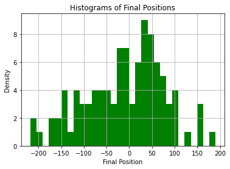
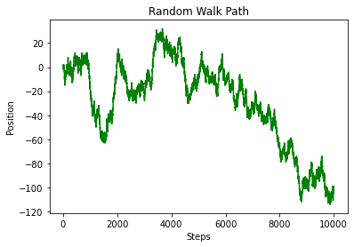
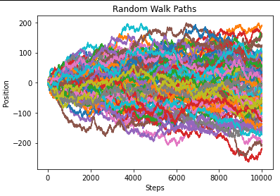

# Random Walk in 1D

This Python program simulates a simple random walk in one dimension.

🔹 A particle starts at position 0 and takes random steps to the left or right.  
🔹 You choose how many steps it takes and how many times to repeat the simulation.  
🔹 The program shows:
- The path of a single particle over time
- The paths of multiple particles in a simulation
- A histogram of the final positions of all particles

## How to Use

1. Run the program:

  random-walk-paths.py

2. Enter how many steps and how many simulations you want.

  It will show the paths and a histogram of final positions.

## Plots

## Requirements

- Python 3
- NumPy
- Matplotlib

Install library with:

pip install numpy matplotlib

## Author

Dimitrios Tsantopoulos
